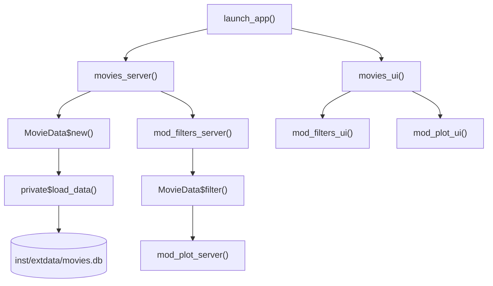

```{r setup, include = FALSE}
knitr::opts_chunk$set(
  collapse = TRUE,
  comment  = "#>"
)
library(movexplR6)
db_path <- system.file("extdata/movies.db", package = "movexplR6")
```

## Overview

`movexplR6` is a Shiny app-package for exploring a movie database that
combines [Rotten Tomatoes](https://www.rottentomatoes.com/) and
[IMDb](https://www.imdb.com/) data. It modernizes the classic
`051-movie-explorer` Shiny example by:

- Replacing `ggvis` with `ggplot2` + `plotly` for interactive scatter plots.
- Replacing `wellPanel` layouts with `bslib` (`page_sidebar`, `card`).
- Wrapping all database and filter logic in an **R6 class** (`MovieData`).

## Architecture

The package is organized into three layers:

```{r arch-diagram, echo = FALSE, results = "asis"}
cat('

')
```

## The `MovieData` R6 class

`MovieData` owns the database connection and exposes two public methods:
`$filter()` for querying the in-memory data, and `$finalize()` for
cleaning up the connection.

### Connecting and loading data

```{r init}
md <- MovieData$new(db_path)
```

On initialization the class:

1. Opens a `DBI` connection to the SQLite file.
2. Joins the `omdb` and `tomatoes` tables.
3. Collects the result into `$all_movies` (an in-memory data frame).

```{r all-movies-dims}
dim(md$all_movies)
names(md$all_movies)
```

### Filtering

`$filter()` accepts the same parameters exposed by the Shiny sidebar and
returns a filtered data frame with an added `has_oscar` column.

```{r filter-defaults}
defaults <- md$filter()
nrow(defaults)
```

**Filter by minimum reviews:**

```{r filter-reviews}
strict <- md$filter(reviews = 200)
nrow(strict)
```

**Filter by genre:**

```{r filter-genre}
drama <- md$filter(genre = "Drama")
nrow(drama)
head(drama[, c("Title", "Year", "Genre", "Oscars", "has_oscar")], 5)
```

**Filter by year range:**

```{r filter-year}
nineties <- md$filter(year = c(1990, 1999))
range(nineties$Year)
```

**Filter by box-office range (millions):**

```{r filter-boxoffice}
blockbusters <- md$filter(boxoffice = c(200, 800))
nrow(blockbusters)
```

**Filter by director (partial, case-insensitive):**

```{r filter-director}
spielberg <- md$filter(director = "Spielberg")
unique(spielberg$Director)
```

**Combining filters:**

```{r filter-combined}
combined <- md$filter(
  genre    = "Action",
  oscars   = 1,
  year     = c(2000, 2014),
  director = "Nolan"
)
combined[, c("Title", "Year", "Director", "Oscars")]
```

### The `has_oscar` column

`$filter()` always appends a `has_oscar` character column (`"Yes"` / `"No"`)
derived from the `Oscars` count. The scatter plot uses this for color encoding.

```{r has-oscar}
table(defaults$has_oscar)
```

### Disconnecting

Call `$disconnect()` to explicitly close the database connection. This is also
called automatically via `shiny::onStop()` inside `movies_server()`. The private
`finalize()` method delegates to `$disconnect()` so the connection is also
closed when the object is garbage collected.

```{r disconnect}
md$disconnect()
DBI::dbIsValid(md$con)
```

## Axis variables

`axis_vars` is a named character vector mapping display labels to column names.
Both `mod_filters_ui()` and `mod_plot_server()` use it to populate the axis
selector inputs.

```{r axis-vars}
axis_vars
```

## Shiny modules

### `mod_filters`

`mod_filters_ui(id)` renders two `bslib::card` elements inside the sidebar:
one for filter controls and one for axis selectors. `mod_filters_server(id)`
returns a reactive list of the current selections.

### `mod_plot`

`mod_plot_ui(id)` renders a `bslib::card` containing a `plotly` scatter plot
and a movie count line. `mod_plot_server(id, movies, filters)` accepts the
filtered data reactive and the filter selections reactive, and renders the plot.
Hover tooltips show the movie title, year, and box-office gross.

## Running the app

```{r launch, eval = FALSE}
movexplR6::launch_app()
```
